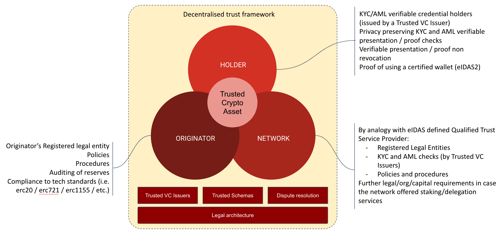
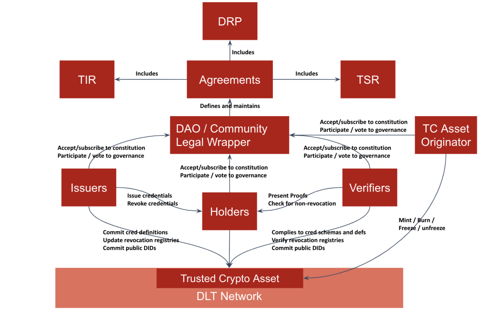
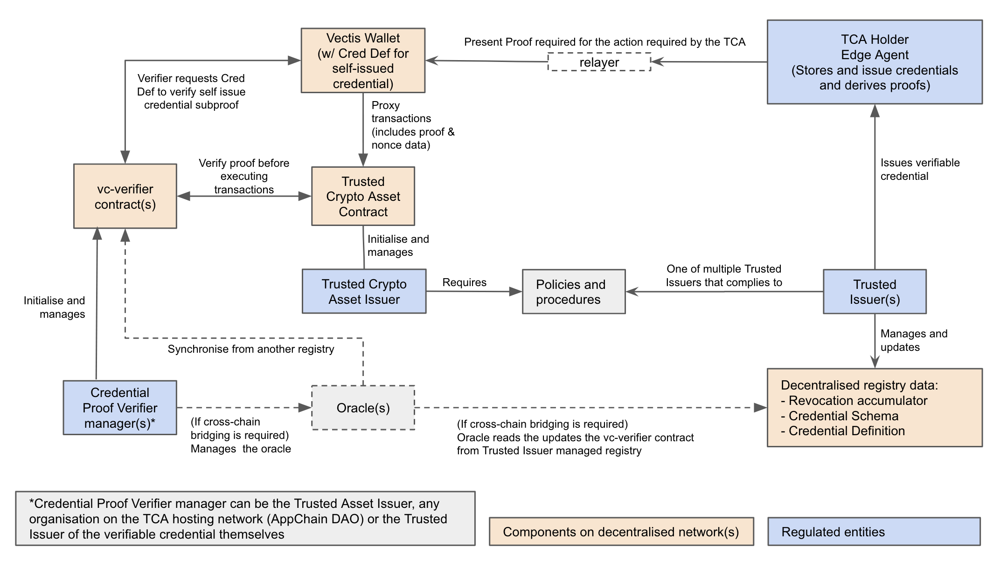

# Trusted Crypto Asset

A trust framework powering regulated crypto assets\
By: [Belsy Yuen](mailto:belsy@nymlab.it), [Elena Chachkarova](mailto:elena@nymlab.it), [Egidio Casati](mailto:egidio.casati@nymlab.it) for [NYMLAB srl](https://www.nymlab.it)

license: CC-BY

Official repo: https://github.com/nymlab/trusted-crypto-asset:

Date: Aug 2022

# Abstract

This document outlines the legal, organisational and technical characteristics of a framework that allows issuers and holders to manage "Trusted Crypto Assets" (TCA) in the context of a permissioned public decentralised network, leveraging on SSI protocols. We define a "Trusted Crypto Asset" as a particular asset class that intends to anticipate and satisfy regulatory requirements regarding the asset issuers, the network where they are minted and their holders.

The first section of the document focuses on the legal and organisational aspects of the framework, describing roles and requirements of the main actors and providing a legal architecture overview while the second part offers the technical framework overview.

# Table of Contents
1. [TCA Legal and Organisational overview](#tca-overview)
    1. [Roles](#roles)
        1. [Originator](#originator)
        1. [Holder](#holder)
        1. [Network](#network)
    1. [Utility Components](#components)
        1. [Trusted Issuers](#issuers)
        1. [Trusted Credential Schema and Definition](#credential)
        1. [Dispute Resolution Procedure](#procedure)
    1. [Legal Archtecture](#legal)
  1. [TCA Technical Overview](#technical)
      1. [Technical Requirements](#requirements)
      1. [Technical Architcture](#architecture)
          1. [Envirinmental Components](#environmental)
          1. [Transaction Validation](#validation)
          1. [Transaction execution strategies](#strategies)
1. [Further Use Cases](#use_cases)
    1. [Membership](#membership)
    1. [Metaverse](#metaverse)
    1. [Consensus Mechanism](#consensus)          
1. [Conclusions and next steps](#next)

## <a id="tca-overview">TCA Legal and Organisational overview</a>

Below is a diagram that outlines the key components of a proposed design pattern for the creation and sustainability of regulated crypto assets. We use the inclusive and risk-mitigating power of decentralisation and combine it with real-time auditing verification and a well-defined set of rules to provide a framework for an accountable, accessible and securely regulated crypto asset ecosystem.

### <a id="roles">Roles</a>

#### <a ID="originator">Originator</a>

To originate a regulated token that can fully leverage on the technological innovation of “trustless” peer to peer exchange of value executed in public decentralised networks:

- The legal entity originating the crypto asset must comply with regulatory licensing, risk and capital reserve requirements
- The token logic must be consistent with the smart contract based standards for fungible, non fungible and composite token structures (e.g. [20](https://docs.openzeppelin.com/contracts/3.x/erc20), [721](https://docs.openzeppelin.com/contracts/3.x/erc721), [1155](https://docs.openzeppelin.com/contracts/3.x/erc1155))
- Policies and procedures regarding the management of fraud-prevention, AML risk on suspected accounts (freeze/unfreeze of funds) must be in place
- A continuous IT security auditing of the mint/burn infrastructure must be assured
- Where the asset is a stable coin, minters must provide real-time third party auditing of fiat reserves

#### <a id="holder">Holder</a>

To be considered regulated, a crypto asset needs to satisfy regulatory requirements regarding its holders.
These requirements may vary on the basis of the crypto asset specific purpose, however, Trusted Crypto Assets imply that a set of minimal requirements are met, like proving that the holder has successfully carried out KYC and AML checks with an ascertainable trusted third party ([trusted issuer](/README.md#trusted-issuers)).
Decentralised identity and SSI protocols allow us to tread a narrow path that combines the user's right to privacy/anonymity with the possibility of on-chain verification that they have successfully, and without revocation, passed KYC and AML checks.
Furthermore, the EU is on the verge of issuing the new rules ([eIDAS2](https://digital-strategy.ec.europa.eu/en/policies/eidas-regulation)) and technical standards (mainly provided by [ETSI](https://www.etsi.org/)) regarding the so-called Identity wallets; in this regard, SSI provides us with the chance to inject in the transaction itself all the needed proofs, allowing for continuous validation of the personal wallet compliance.
Finally, an important client-side technical requirement is the binding between the holder and the verifiable credentials stored on the personal wallet; currently, this feature may be achieved through the adoption of anonymous credential technology.

#### <a id="network">Network</a>

A sustainable proof of stake network, that provides token holders with the possibility to delegate their tokens and contribute to the network’s TVL in exchange for an APR, needs to comply with a number of regulatory constraints.

Know Your Validator (KYV):

- A Trusted Crypto Asset holder who decides to delegate value to a specific validator must be guaranteed by an established assurance and accountability threshold
- The mass adoption of decentralised technologies does not eliminate the need to protect the investor [token holder] willing to invest [stake] their crypto value with a validator
- Standard investor protection rules require moving beyond the concept of a 'trustless' network in favour of an ‘accountable’ network, where the value at stake [TVL] ceases to be the defining security metric, rather, the continuous and transparent process of verification of valid legal requirements and operational soundness becomes the minimum assurance threshold

### <a id="components">Utility components</a> 

#### <a id="issuers">Trusted Issuers</a> 

Trusted Issuers of [verifiable credentials](https://www.w3.org/TR/vc-data-model/#what-is-a-verifiable-credential) (VC) are instrumental to a decentralised trust framework.
Trusted Issuers define a decentralised trust framework:

- It is up to the network participating community ([DAO](https://www.investopedia.com/tech/what-dao/)) to establish and maintain the principles [requirements and constraints] regarding the trustability of assertions [VCs and proofs] based on the ascertainability of their Trusted Issuers
- The set of Trusted Issuers can be generally defined [eIDAS Trust Service Provider List] or locally specified, eventually inheriting the general available entities and integrating the set with specific third parties
- Most importantly, the shift from a federated identity schemas ([SAML](https://www.cloudflare.com/en-gb/learning/access-management/what-is-saml/), [Oauth2](https://oauth.net/2/) and [OIDC](https://openid.net/connect/)) where synchronous interaction with the identity provider is required to SSI allows for a full peer-to-peer interaction between the (credential) holder and the verifier

#### <a id="credential">Trusted [credential schemas and definitions](https://www.w3.org/TR/vc-data-model/#data-schemas)</a>

Once the set of issuers that may be considered trusted has been defined by the verifier, the holder can derive and present a proof from one or more of those trusted issuer credentials. The other founding element of a decentralised trust framework is the type and template structure of the assertions that the issuers (and the verifiers) agree upon to reach full interoperability and completion of information.
This can be achieved:

- At Domain/Community/DAO level, where all the participant, through a voting mechanism achieve consensus around a specified list of credential schemas
- At verifier level, where the single entity can decide to shape its own trusted set of credential, eventually integrating the community-based list

#### <a id="procedure">Dispute resolution procedure</a>

The organisation of a participating community [DAO] around a set of principles and tools provides the backdrop for the incentives sustaining the accountability and liability threshold of different roles (verifiers, holders, issuers, DAOs) and helps defining pragmatic dispute resolution process ahead of comprehensive regulation.
Initiatives like [identrust](https://www.identrust.com/) have demonstrated that this approach is feasible and may benefit the community, introducing the necessary legal components to support operations from a business standpoint.
In concrete, the procedure should be based on a set of standardized technical evidences that the parties involved in a dispute can bring along, for instance:

- Proof, as an issuer, to comply to the community established set of protocols for evaluating a holder request to issue a specific type of credentials
- Issuer due diligence in case of credential revocation (proofs regarding the internal process to manage the revocation request, until publishing the revocation on-chain - for instance via crypto accumulator)
- Proof as a holder, to be in sole control of the credentials (credential-holder binding in case of [anonymous cred](https://wiki.hyperledger.org/download/attachments/6426712/Anoncreds2.1.pdf))
- Verifier due diligence in case of presentation request protocol and proofs of non revocation checks

### <a id="legal">Legal Architecture</a>

The diagram below represents the general perspective of a decentralised trust network that we believe is necessary for a crypto asset to be regulated, and it summarises the relations existing among all components.

## <a id="technical">TCA Technical overview</a>

In this section we focus on describing the technical aspects of the TCA framework, describing a set of minimal requirements that the solution must fulfill and defining a candidate architecture.

### <a id="requirements">Technical Requirements</a>

- Eligibility of the holders to manage TCA must be verified on the base a verifiable proof;
- Verifiable proof must prove:
  - The user has received a (set of) verifiable credential(s) of a specific type (credential schema),
  - The user has received the (set of) verifiable credential(s) from one (or more) issuer(s) included in a list of Trusted Issuers and only eligible third parties should be able to look up the public [DID](https://www.w3.org/TR/did-core/#dfn-decentralized-identifiers) of the real issuer;
- Verifiable proof must not disclose any PII of the User, apart from pseudonyms information;
- A distinct verifiable proof must be provided by the holder for each transfer of TCA;
- The verifier must be able to check for revocation of the verifiable credentials from which the proof has been derived;
- In the case of revoked credentials, the TCAs controlled by the holder cannot be transferred and may become frozen until the holder provides a valid/non-revoked proof.

### <a id="architecture">Technical Architecture</a>

The diagram below shows a reference architecture for the TCA, this is a generic framework for the TCA to work on any decentralised networks.

#### <a id="environmental">Environmental Components</a>

- A Trusted Crypto Asset that complies with regulatory requirements regarding their holders (e.g. KYC and AML verification for stable coin holders; proof of registration for regulated broker dealing with specific crypto asset classes)
- A decentralised network, where fully-regulated tokens can be exchanged among addresses presenting verifiable privacy-protecting proofs
- A smart contract wallet architecture, providing social recovery with transaction relayer. An example of such type of wallet is the open source project [VectisDAO](https://github.com/nymlab/vectis)
- A mobile identity wallet, with cryptographic material for controlling the smart contract wallet, holding credentials and deriving proofs
- A set of Trusted Issuers, selected by the decentralised application (in this case the Trusted Crypto Asset) / Decentralised network's DAO on the base of the policies and procedure adopted, with the capacity to issue verifiable credentials for legal and regulatory compliance

#### <a id="validation">Transaction validation</a>

At the time of spending (i.e. transferring to another account) of the TCA, for a successful transaction, the holder must provide:

- standard signed transaction payload for the transfer: this payload includes:
  - a proof derived from the received VCs, including a nonce in order to avoid reply attack and to bind the proof presentation to the transfer
  - the transaction details, such as the receiver and asset amount

This two objects shall be produced by an edge agent (e.g. a mobile wallet controlling the proxy wallet and the attached funds, able to control the Verifiable Credential and derive proofs) and send to the network via a relayer (optional)

The relayer, which is network specific, shall sign (potential attached audit required data) and route the holder's signed payload to the proxy wallet, in order to be executed by the TCA contract

Before committing the new state, the Trusted Crypto Asset contract will query the vc-verifier contract with the provided proof for verification

In this scenario, the business logic for the validation is mainly done by the vc-verifier contract, leaving a minimum amount of work to the Trusted Crypto Asset issuer, in terms of validation.

#### <a id="strategies">Transaction Execution strategies</a>

Assuming we have a sender and a receiver, the validation strategy of a transfer of TCA from sender to receiver may be implemented in at least two different way:

- validation of the sender: in this case, only the sender is required to provide a verifiable proof at time of transfer, and no validation is applied to the receiver. The receiver will not be able to spend their token unless they provide a verifiable proof.
- validation of both sender and receiver: in this case, in order to validate both the subjects, the transaction is split in two sub transactions:
  - sender executes allowance in favour of receiver, up to a specific amount
  - receiver executes a claim

## <a id="use_cases">Further Use Cases</a>
### <a id="membership">Membership</a>

TCA can be adopted as a design pattern to make group join operations by an account more efficient, particularly when the evaluation of the group join request is conditional on the verification of particular account requirements.

Considering for example the case of the 'trusted circle' in the [TGRADE network](https://medium.com/tgradefinance/defi-on-tgrade-trusted-circles-39ae3c687a80), the evaluation of a request to join the trusted circle could be executed automatically by a verifier, instead of being left to a majority vote.

Manual voting could instead be limited to 'configuration' aspects of the group, such as the maintenance of the credential schemas, the list of eligible Trusted Issuers and their credential definitions, as well as the legal regulatory aspects to which each account implicitly adheres.

### <a id="metaverse">Metaverse</a>

A special case of association to a group on the basis of the possession of specific requirements is the metaverse, and in particular the cases in which the account must prove possession of certain requirements while maintaining full confidentiality of the shared information.

The use cases of gaming, and in particular of the metaverse, are already brilliantly solved, as far as the area of digital identity is concerned, by the solution of - for instance - soulbound tokens: in these cases privacy is not a requirement, rather the users use the SBT as a badge to be presented along with any other fungible or non-fungible asset controlled by their account.

on the other hand, if we consider the need to prove other attributes of the account, and in particular of its holder, that relate to privacy, such as age (or the fact of being of age) or nationality (in order not to incur the violation of any constraints by the platform), the TCA can help resolve these use cases.

### <a id="consensus">Consensus Mechanism</a>

the regulatory evolution is coming to consider, in particular in the case of Proof-of-Stake, validator nodes as financial service providers, depending on the staking operations they support.

A scenario is thus taking shape in which, for some specific protocols, certain requirements (e.g. in terms of certification, regulatory capital, etc.) must be met in order to participate to the network.

If these requirements were to be verified centrally, only during the onboarding phase and then through occasional auditing operations, the expansion of the network would be poorly scalable and the Proof-of-Stake would risk collapsing substantially on a Proof-of-Authority.

Thanks to TCA, it is possible to imagine that each validator node, in the block proposition or block voting phases, provides its own credentials (or proof) and these are verified by the entire network, so that the signature on the block is considered valid. 

This would allow to have a multiplicity of subjects that carry out certification activities of the node requirements (and therefore issuing of credentials) and to have an automatic adhesion to the network for all subjects who have such requirements.

Furthermore, the existence of these requirements could be verified on the occasion of each round of block production, thanks to the verification of non-revocation of the credentials.

## <a id="next">Conclusions and next steps</a>

This document stems from the convergence of a number of elements:

- our vision with respect to the growing emergence of public and decentralised networks
- the need to assure infrastructural user protection and user experience ahead of mass adoption
- the anticipation of a regulatory framework coherent with the full potential of the new technology

At the moment, we can only speculate upon the trajectory that regulation will take with respect to public and decentralised networks. Our hypotheses from which this proposal was born will be gradually updated to take in account the forthcoming regulatory changes.
