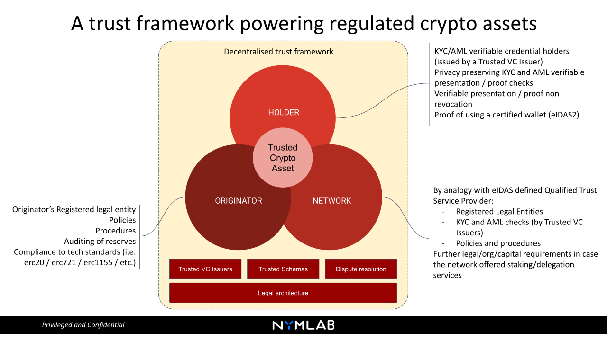
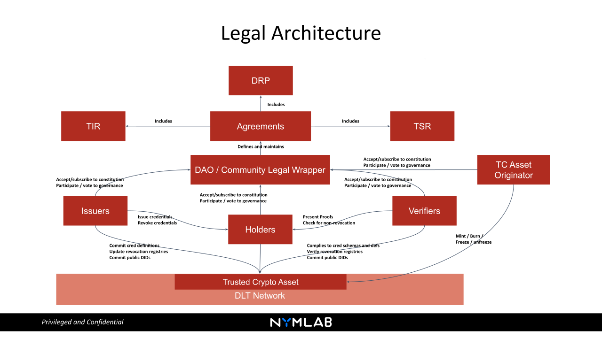

# Trusted crypto asset

A trust framework powering regulated crypto assets\
By: [Egidio Casati](mailto:egidio.casati@nymlab.it); [NYMLAB](https://www.nymlab.it/#/)\
Date: July 2022

## Overview

Below is a diagram that outlines the key components of a proposed design pattern for creation and sustainability of regulated crypto assets. By using the power of decentralisation and combining it with auditing, verification and well defined rules we aim to utilise the best of both worlds and provide a framework for building an accountable, accessible and secure regulated crypto asset ecosystem.

## Roles

### Originator

In order to originate a regulated token that can fully leverage on the technological innovation of “trustless” peer to peer transactions executed in a public decentralised network:

* The legal entity originating the crypto asset must comply with regulatory licensing, risk and capital reserve requirements
* The token logic must be consistent with the smart contract based standards for fungible, non fungible and composite token structures (i.e. [20](https://docs.openzeppelin.com/contracts/3.x/erc20), [721](https://docs.openzeppelin.com/contracts/3.x/erc721), [1155](https://docs.openzeppelin.com/contracts/3.x/erc1155))
* The minters of stable coins must provide real-time third party auditing of fiat reserves  
* Policies and procedures regarding the management of fraud-prevention, AML risk on suspected accounts (freeze/unfreeze of funds) must be in place
* A continuous IT security auditing of the mint/burn infrastructure must be assured

### Holder

To be considered regulated, a Crypto Asset needs to satisfy regulatory constraints regarding their holders. 
These constraints may vary on the basis of the Crypto Asset specific nature, but we assume that a set of minimal requirements should be met, like proving that the holder has successfully carried out KYC and AML checks with an ascertainable trusted third party ([trusted issuer](/README.md#trusted-issuers)).
Decentralised identity and SSI protocols allow us to tread a narrow path that combines the user's right to privacy/anonymity with the possibility of on-chain verification that they have successfully, and without revocation, passed via KYC and AML checks.
Furthermore, EU is on the verge of new rules ([eIDAS2](https://digital-strategy.ec.europa.eu/en/policies/eidas-regulation)) and technical standards ([ETSI](https://www.etsi.org/)) regarding the user wallets; in this regard, SSI provides us with the chance to inject in the transaction itself all the proofs needed to continuously validate the wallet compliance.
Finally, an important client-side technical requirement is the binding between the holder and the verifiable credential stored on the wallet; currently, this feature may be achieved through the adoption of anonymous credential technology.

### Network

A sustainable proof of stake network, that provides token holders with the possibility to delegate their tokens and contribute to the network’s TVL in exchange of an APR, needs to comply with a number of regulatory constraints, Know Your Validator (KYV):

* A crypto asset holder who decides to delegate value to a specific validator must reach an established level of assurance and accountability threshold 
* The mass adoption of decentralised technologies does not eliminate the need to protect the investor [token holder] willing to invest [stake] their crypto value with a validator
* Standard investor protection rules require moving beyond the concept of a 'trustless' network in favour of an ‘accountable’ network, where the value at stake [TVL] cease to be the defining security metrics, rather, the continuous and transparent process of verification of valid legal requirements and operational soundness become the minimum guarantee threshold

## Utility components

### Trusted Issuers

Trusted Issuers of [Verifiable Credentials](https://www.w3.org/TR/vc-data-model/#what-is-a-verifiable-credential) (VC) are instrumental to a decentralised trust framework. 
Trusted Issuers define a decentralised trust framework:
* It is up to the network underlying community ([DAO](https://www.investopedia.com/tech/what-dao/)) to establish and maintain the principles [requirements and constraints] regarding the trustability of assertions [VCs and proofs] based on the ascertainability of their Trusted Issuers
* The set of Trusted Issuers can be generally defined [eIDAS Trust Service Provider List] or locally specified, eventually inheriting the general available entities and integrating the set with specific third parties 
* Most importantly, the shift from a federated identity schemas ([SAML](https://www.cloudflare.com/en-gb/learning/access-management/what-is-saml/), [Oauth2](https://oauth.net/2/) and [OIDC](https://openid.net/connect/)) where synchronous interaction with the identity provider is required to SSI allows for a full peer-to-peer interaction between the (credential) holder and the verifier

### Trusted [credential schemas and definitions](https://www.w3.org/TR/vc-data-model/#data-schemas)

Once the set of issuers that may be considered trusted has been defined by a verifier, the issuer can derive a proof from one or more of those trusted issuer credentials. The other founding element of a decentralised trust framework is the type and template structure of the assertions that the issuers (and the verifiers) agree upon to reach full interoperability and completion of information.
This can be achieve:
* At Domain/Community/DAO level, where all the participant, through a voting mechanism achieve consensus around a specified list of credential schemas
* At verifier level, where the single entity can decide to shape its own trusted set of credential, eventually integrating the community-based list

### Dispute resolution procedure

The organisation of a community around a set of principles and tools sets the basis to elaborate strategies regarding accountability, liability of different roles (verifiers, holders, issuers, DAOs) and to help in defining dispute resolution strategies, as a pragmatic approach in the wait for a broaden regulation.
Initiatives like [identrust](https://www.identrust.com/) have demonstrated that this approach is feasible and may benefit the community, introducing the necessary legal components to support operations from a business standpoint.
In concrete, the procedure should be based on a set of standardized technical evidences that the involved parties may bring on in a dispute, for instance:
* Proof, as an issuer, to comply to the community established set of protocols for evaluating a holder request to issue a specific type of credentials
* Issuer due diligence in case of credential revocation (proofs regarding the internal process to manage the revocation request, until publishing the revocation on-chain - for instance via crypto accumulator)
* Proof as a holder, to be in sole control of the credentials (credential-holder binding in case of [anonymous cred](https://wiki.hyperledger.org/download/attachments/6426712/Anoncreds2.1.pdf))
* Verifier due diligence in case of presentation request protocol and proofs of non revocation checks

## Legal Architecture

The diagram below represents the general perspective of a decentralised trust network that we believe is necessary for a crypto asset to be regulated, and it summarises the relations existing among all components.

## Requirements

* Mandatory: Verifiable proof must be verifiable by any third party looking at the chain (and particularly to the proxy wallet holding the Trusted Crypto Asset)
* Mandatory: Verifiable proof must be derived by a (or a set of) Verifiable Credential(s) controlled by the User's local account - Credentials are - always - off chain
* Mandatory: Verifiable Proof must not disclose any PII of the User, apart from pseudonyms information
* Mandatory: Verifiable Proof must prove:
    - The User has received a (set of) Verifiable Credential(s) of a specific type (credential schema)
    - The User has received the (set of) Verifiable Credential(s) from one (or more) Issuer(s) included in a list of Trusted Issuers and only eligible third parties should be able to look up the real Issuer public [DID](https://www.w3.org/TR/did-core/#dfn-decentralized-identifiers)
* Mandatory: Any third party must be able to check for revocation of the Verifiable Credentials from which the Proof has been derived
* Mandatory (case specific): In case of revocation of the verifiable credentials, the proof must be invalidated
* Mandatory: In case the proof is invalidated and the holder owns trusted crypto asset, those asset should become frozen. Invalidated proof does not imply losing control of the wallet: there could be use cases where the user, with their local account, is still in control of their proxy wallet, but the credential expires (when validity period apply, such in case as licenses, certifications etc.) and so the proof is invalidated. In this case, the holder will still be able to manage untrusted crypto asset only

## Reference Implementations
A practical implementations of a Trusted Crypto Asset framework

